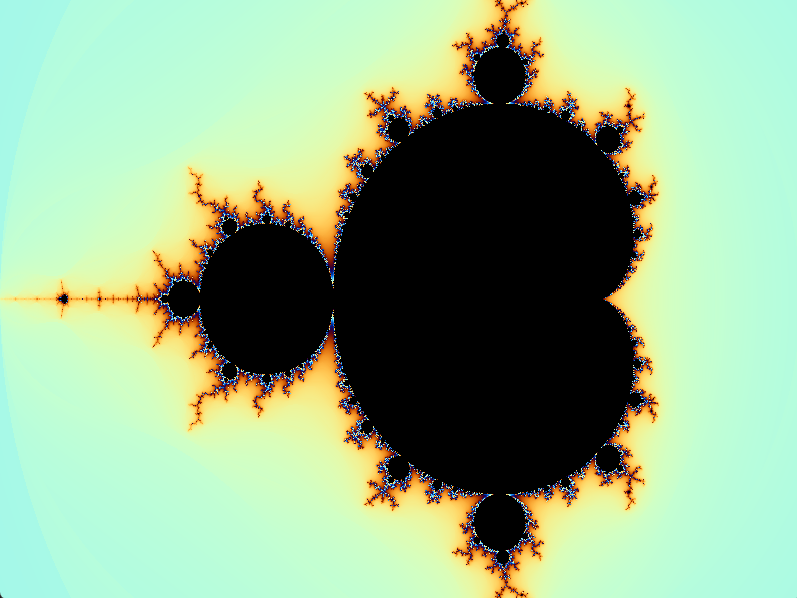
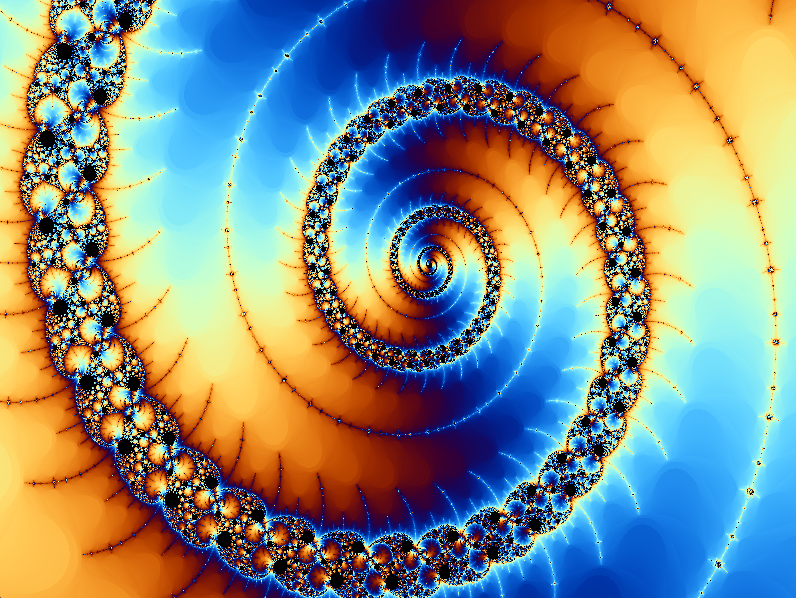

# 🌌 GPU-Accelerated Mandelbrot Fractal Viewer (Python + GLSL)

An interactive, real-time explorer for the Mandelbrot fractal, calculated entirely on the GPU using Python, PyOpenGL, and GLSL shaders. This project renders the fractal at high frame rates and allows for "infinite" zooming by using 64-bit double-precision compute directly in the shader.

## 📸 Showcase






---

## ✨ Features

This project was an exercise in modern GPU computing and real-time visualization, bypassing calculation libraries (like Numba/PyCUDA) and rendering engines (like Pygame) that can cause hardware context conflicts.

* **100% GPU-Rendered:** The fractal is calculated and colored in real-time for every pixel using a **GLSL Fragment Shader**. The data never leaves the VRAM.
* **"Infinite" Zoom (Double Precision):** The shader uses `#version 420 core` to perform all calculations with `double` (64-bit) instead of `float` (32-bit). This prevents the pixelation and loss of definition that occurs during deep zooms with single precision.
* **Progressive Rendering:** To maintain interactivity and efficiency:
    * **Fast Preview:** While actively zooming (spinning the mouse wheel), the fractal is re-calculated with a low iteration count (`MAX_ITER_FAST`).
    * **High-Quality Refine:** 0.5 seconds *after* the user stops zooming, the fractal is automatically refined with a much higher iteration count (`max_iter_high`).
* **Dynamic Iterations:** The iteration count for the high-quality render is not fixed. It increases logarithmically as the zoom gets deeper (`new_max_iter = int(base_iter + 50.0 * abs(math.log(new_width)))`), revealing more detail in complex areas.
* **Smooth Coloring:** Uses a `log(log(z_mag))` formula in the shader to calculate a fractional iteration value. This eliminates color "banding" and creates the smooth, detailed gradients seen in the images.
* **Efficient GPU Usage (0% Idle):** The main loop uses `glfw.wait_events_timeout(0.01)`. This puts the application to "sleep" and reduces GPU usage to near 0% when not interacting, preventing the GPU fan from spinning up unnecessarily.

---

## 🛠️ How It Works

The application is split into two parts:

1.  **Python (The Orchestrator - CPU):**
    * Uses `glfw` to create a window and an OpenGL 4.2 context.
    * Uses `PyOpenGL` to compile the GLSL shaders and create a screen-filling rectangle ("quad").
    * Listens for mouse wheel events (`on_scroll`) to calculate the new view coordinates.
    * Manages the progressive rendering logic (when to use `MAX_ITER_FAST` vs. `MAX_ITER_HIGH`).
    * Sends the state variables (coordinates, iterations, color thetas) to the GPU every frame via `uniforms`.

2.  **GLSL (The Muscle - GPU):**
    * The `VERTEX_SHADER` is simple: it just draws the rectangle on the screen.
    * The `FRAGMENT_SHADER` does all the heavy lifting. It runs in parallel for **every single pixel** on the screen:
        * Converts the pixel's coordinate (e.g., `[250, 400]`) to a complex number (`c`) using the `u_view` coordinates and `double` precision.
        * Runs the "escape-time" algorithm ($z = z^2 + c$) for that point.
        * Calculates the `smooth_iter` value for smooth coloring.
        * Passes that value to the `colormap` function to get a vibrant RGB color.
        * Outputs the final color (`FragColor`).

---

## ⌨️ Controls

* **Mouse Wheel:** Zoom in and out (centered on the cursor).
* **Close Window:** Exit the application.

---

## ⚙️ Setup and Run

This script requires Python 3 and a graphics card that supports **OpenGL 4.2** or higher (required for 64-bit `double` precision in shaders).

1.  **Clone the repository:**
    ```bash
    git clone https://github.com/asaezs/MandelbrotGPU.git
    cd MandelbrotGPU
    ```

2.  **Create a virtual environment:**
    ```bash
    python -m venv venv
    source venv/bin/activate  # (On Linux/macOS)
    .\venv\Scripts\activate   # (On Windows)
    ```

3.  **Install dependencies:**
    ```bash
    pip install numpy glfw PyOpenGL PyOpenGL_accelerate
    ```

4.  **Run the script:**
    ```bash
    python mandelbrot.py
    ```
